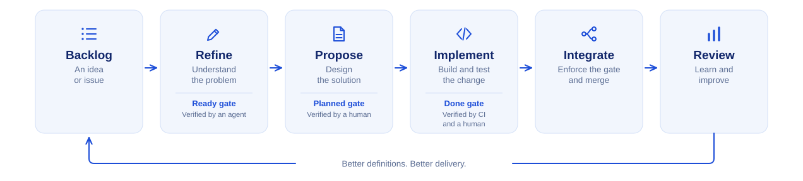

# `agentic-sdlc`

An adaptive development lifecycle for agent-driven delivery: readiness and verification gates, deterministic checks, and explicit human approval, adapted to the tools a project already uses.

It imposes no tracker, no ai harness or engine, no CI system and no methodology. The `adopt` command discovers what a project already uses and writes that down as the project's own configuration.



_Overview only. The normative definitions are the ones `adopt` command writes into each project's own `docs/engineering-lifecycle.md`._

## Scope

The development change lifecycle, from backlog and refinement through planning, implementation, integration and review.

No capability invokes the next. Each ends at a gate and names what follows.

| Gate    | Where              | Question                               | Verified by                                                                                |
| ------- | ------------------ | -------------------------------------- | ------------------------------------------------------------------------------------------ |
| Ready   | end of `refine`    | Is the problem sufficiently defined?   | An agent, semantically, alerting a human                                                   |
| Planned | end of `propose`   | Is the solution sufficiently designed? | A human, reviewing the plan in a draft pull request                                        |
| Done    | end of `implement` | Is the change sufficiently verified?   | Two lanes: CI and tooling for the deterministic items, a named role for the judgement ones |

## Out of scope

- Deployment, release management and environment promotion.
- Test authoring and CI pipeline authoring.
- Infrastructure and IaC.

## Ownership

Each adopting project owns its lifecycle configuration after `adopt` writes it. This package itself is maintained in the agent-toolkit repository.

## Contents

Seven capabilities, each with a command entry point and a skill that owns its steps. Ten supporting skills the capabilities call. Two agents. Twenty-five role-capability templates as adoption payload.

### Commands

All namespaced under the plugin, so `/agentic-sdlc:refine PROJ-123`.

| Command     | What it does                                                      |
| ----------- | ----------------------------------------------------------------- |
| `adopt`     | Bootstrap or reconcile this project's lifecycle configuration     |
| `refine`    | Stage 1: take an idea or item to the Definition of Ready          |
| `propose`   | Stage 2: design the solution and raise it as a draft pull request |
| `implement` | Stage 3: apply the plan and take the change to the Done gate      |
| `integrate` | Stage 4: enforce the gate, merge, and close the loop              |
| `review`    | Stage 5: learn from the cycle and amend the process               |
| `status`    | Read-only: where an item sits and what comes next                 |

### Agents

| Agent                                                                     | Why it exists                                                                                                                                                                                          |
| ------------------------------------------------------------------------- | ------------------------------------------------------------------------------------------------------------------------------------------------------------------------------------------------------ |
| [`agentic-sdlc.done-gate-auditor`](agents/done-gate-auditor.agent.md) | **Required at the Done gate.** Audits the plan against the actual diff in a context that did not write the change, checks evidence completeness, and prepares the judgement items without deciding any |
| [`agentic-sdlc.flow-reporter`](agents/flow-reporter.agent.md)         | Optional. Gathers tracker, branch, pull request and CI state in its own context so the raw output never reaches the working session                                                                    |

Agents are not lifecycle stages. They are used only where isolation or delegation is an explicit requirement.

### Skills

The seven capabilities: [`adopt`](skills/adopt), [`refine`](skills/refine), [`propose`](skills/propose), [`implement`](skills/implement), [`integrate`](skills/integrate), [`review`](skills/review), [`status`](skills/status).

| Supporting skill                            | Job                                                                 |
| ------------------------------------------- | ------------------------------------------------------------------- |
| [`refine-to-ready`](skills/refine-to-ready) | Judge an item against the Definition of Ready                       |
| [`verify-done`](skills/verify-done)         | Assess a change against the Definition of Done, in both lanes       |
| [`verify-like-ci`](skills/verify-like-ci)   | Run locally what CI will run, derived from the pipeline definitions |
| [`verify-runtime`](skills/verify-runtime)   | Drive the real application and capture the evidence                 |
| [`harden-process`](skills/harden-process)   | Turn one failure into the smallest durable guard                    |
| [`review-entry`](skills/review-entry)       | Append one dated entry to the review log                            |
| [`collect-usage`](skills/collect-usage)     | Human-versus-agent effort from captured telemetry                   |

Three further skills are shared with the parent repository's root collection and installed through its [`apm.yml`](apm.yml) git dependency rather than duplicated here: [`adr`](../../skills/adr), [`rebase-safely`](../../skills/rebase-safely), and [`git-worktrees`](../../skills/git-worktrees). They are validated, versioned, and distributed from one canonical copy in `skills/`.

## What adoption writes into a project

```text
docs/engineering-lifecycle.md      the Definition of Ready and Definition of Done,
                                   the stage-to-state mapping, the roles
.agents/skills/<role>/SKILL.md     one per role capability the project needs
```

That configuration carries every point of coupling. Every capability reads it; none hardcodes an answer.

**The project owns it after adoption.** Templates under `skills/adopt/assets/role-skills/` are starting points, not authoritative copies. Re-running `adopt` reconciles against what the project has made of them, proposes changes as diffs, and preserves customisation.

Role templates are named `SKILL.template.md`, never `SKILL.md`, so no harness can load them as active skills.

Where a specification tool such as OpenSpec is already present, adoption does not install the plan-artifact templates: the tool's own initialiser generates version-matched skills under its own names. Adoption records the mapping in the configuration's **Provided roles** section — which generated skill satisfies each plan-artifact contract — so the lifecycle stages dispatch on a live-resolved name instead of calling a role that was never installed.

Contributions welcome, see the repository [`CONTRIBUTING.md`](../../CONTRIBUTING.md).
